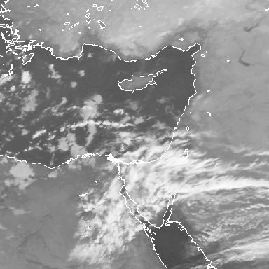
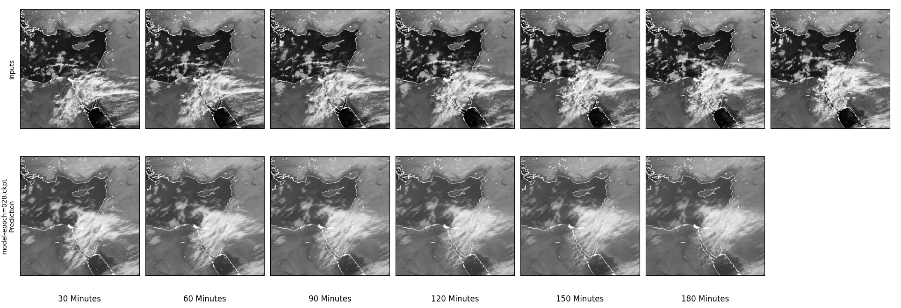

## Cloud Forcasting Transformer

### Demo
Try our inference demo at [DEMO.ipynb](https://colab.research.google.com/github/leahandofir/cloud-forecasting-transformer/blob/main/DEMO.ipynb).

### Introduction
Our work tackles the problem of cloud cover nowcasting using Deep Learning. Nowcasting is a field of meteorology which aims at forecasting weather for a short term of up to a few hours. Cloud cover, as the name suggests, refers to the fraction of the sky covered by clouds at some geographical location. Our work bases on the Earthformer, a Transformer model created by Amazon science. 
We train the Earthformer on our original dataset composed of satellite images provided by the Israeli Meteorological Service (IMS).

The model's input is a sequence of 13 satellite images taken 15 minutes apart. The model's output is 12 images that represent the prediction of the next satellite images following the input sequence.

<center>

|  Input  |  Target  | Prediction |
|:-------------------------:|:-------------------------:|:-------------------------:|
|    |    |    |
|    |    |    |
|    |    |    |


</center>

## Installation
### Train
Install CUDA (We had CUDA 11.7 or 11.8 installed): https://developer.nvidia.com/cuda-downloads

Clone the repository and install requirements:
```
git clone https://github.com/leahandofir/cloud-forecasting-transformer.git
cd cloud-forecasting-transformer
pip install -r train_requirements.txt
python3 -m pip install -U -e . --no-build-isolation --extra-index-url --trusted-host
```

Set up wandb if used:
```
pip install wandb
wandb login
```

### Inference
The inference was tested on windows only.
Clone the repository and install requirements:
```
git clone https://github.com/leahandofir/cloud-forecasting-transformer.git
cd cloud-forecasting-transformer
pip install -r inference_requirements.txt
python3 -m pip install -U -e . --no-build-isolation --extra-index-url --trusted-host
```

## Cloudformer and Baselines Training
We have a different training script for the Cloudformer model and for each one of the baselines. All training scripts inherit from [ims_train.py](src/earthformer/train/train_ims.py) which defines the logging, validation metrics, shared training paramerers (like early stopping) and `main()` function. The training scripts are located [here](./scripts/) and vary in the loss functions used and other training parameters. 

A simple example of training is as follows: 
```
python ./scripts/cuboid_transformer/ims/train_cuboid_ims.py --cfg cfg_ims.yaml
``` 

The training receives a configuration file in YAML format that defines the data train/test split and other training hyperparameters like the learning rate. An example of a configuration file is [cfg_ims.yaml](./scripts/cuboid_transformer/ims/cfg_ims.yaml). 

When training from a checkpoint, a .ckpt file needs to be provided:
```
python ./scripts/cuboid_transformer/ims/train_cuboid_ims.py --ckpt best.ckpt
```

Although not recommended, if one wants to override the hyperparameters in the .ckpt file, it can be done by giving a .yaml configuration file that overrides only the desired attributes. For example: 

**additional_cfg.yaml:**
```
optim:
  save_top_k: 8
logging:
  wandb:
    project: "cloud-forecasting-transformer-try”
```  
**command:**
```
python ./scripts/cuboid_transformer/ims/train_cuboid_ims.py --ckpt best.ckpt --cfg additional_cfg.yaml
```

The training of the baselines share the same concepts. </br>
You can read more about the possible arguments in [ims_train.py](./src/earthformer/train/README.md).

The best weights and their matching configurations are provided here: 

| Model       | Script Folder                                                                                           | Pretrained Weights                                                                                                                           | Config                                                     |
|---------------|---------------------------------------------------------------------------------------------------------|----------------------------------------------------------------------------------------------------------------------------------------------|------------------------------------------------------------|
| cloud-forcasting-transformer         | [train_cuboid_ims.py](./scripts/cuboid_transformer/ims/train_cuboid_ims.py)  | [cloudformer_checkpoints](https://drive.google.com/drive/folders/1lSEdvluW4mX7gntkwqectoZa43RZqK2u?usp=sharing) (Only the best checkpoints)  | [cofigs_ims](./scripts/cuboid_transformer/ims/ir_experiments_configs) |
| PredRNN | [train_predrnn_ims.py](./scripts/baselines/predrnn/train_predrnn_ims.py)                                | [predrnn.ckpt](https://drive.google.com/file/d/1awLeBUUIQKFS9luneyA6lQdkaeDRMMSc/view?usp=sharing)                                           | [cfg_ims.yaml](./scripts/baselines/predrnn/cfg_ims.yaml)   |
| Rainformer | [train_rainformer_ims.py](./scripts/baselines/rainformer/train_rainformer_ims.py)                       | [rainformer.ckpt](https://drive.google.com/file/d/1PcA9r3xf1WQkim5fV1mX7Y5eoJXw5mLw/view?usp=sharing)                                        | [cfg_ims.yaml](./scripts/baselines/rainformer/cfg_ims.yaml) |

## Inference

The inference script is located at [ims_inference.py](scripts/cuboid_transformer/ims/ims_inference.py). Prior to execution, one must prepare:  
&ndash; A checkpoint file of a trained model.  
&ndash; A directory with the input sequence in PNG format and in the naming convention *`%Y%m%d%H%M.png`*.

A simple example of inference is as follows:
```
python scripts/cuboid_transformer/ims/ims_inference.py --ckpt [path-to-ckpt-file] --data-dir [path-to-data-dir] --start-time [time-in-format-%Y%m%d%H%M]
```

You can read more about the possible arguments in [ims_inference](./scripts/cuboid_transformer/ims/README.md).


The script outputs a PNG file that contains the prediction for the given input (the first row is the input sequence, and the second row is the model's prediction):



## Credits
©EUMETSAT 2023

Earthformer: https://github.com/amazon-science/earth-forecasting-transformer

SEVIR: https://sevir.mit.edu/

PredRNN: https://github.com/thuml/predrnn-pytorch

Rainformer: https://github.com/Zjut-MultimediaPlus/Rainformer

Special thanks to [Theator](https://theator.io) for providing us with compute resources :heart:
